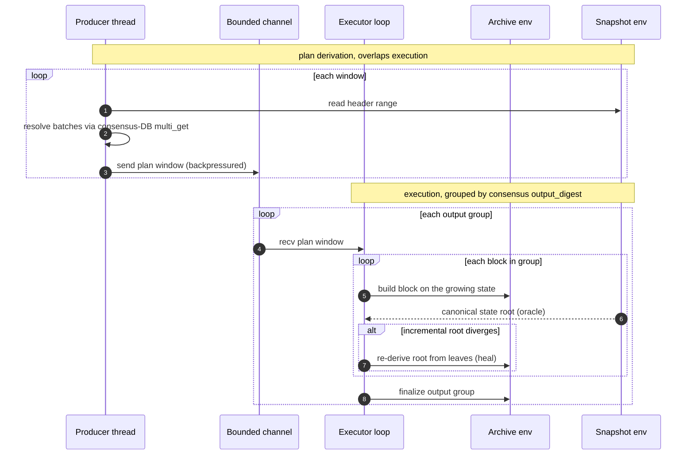

# rayls-replay

Scripted historical replay from a Rayls snapshot into a fresh archive datadir.

`rayls-replay` rebuilds a full (unpruned) execution datadir by re-executing every
block of a snapshot on a clean reth environment. The snapshot's reth datadir is
read as a totally-ordered execution plan; the consensus DB supplies the batch
payloads. Correctness is gated on a per-block state-root match against the
snapshot. On completion the rebuilt datadir is ready to boot via
`rayls-network node` in Observer mode.

## When to use it

- Reconstruct a full-archive node from a pruned snapshot without re-running consensus.
- Reproduce historical state at a specific block for debugging or forensics.
- Validate that a snapshot's execution DB and consensus DB agree end to end.

## How it works

The replay is a single-reader, single-writer pipeline over two reth environments:

- **snapshot env** (read-only): the authoritative source. Supplies the canonical
  header for every block and the committed close-epoch withdrawals tally.
- **archive env** (read-write): the target. Each block is rebuilt on top of the
  archive's growing state.



1. **Plan derivation** (`plan.rs`). A blocking producer thread walks `from..=to`
   in fixed windows. Each window reads the snapshot header range in one call and
   resolves every content block's batch from the consensus DB in a single
   `multi_get`, amortizing transaction setup. Windows are sent over a bounded
   channel, so a slow executor applies backpressure to the producer.

2. **Output-group execution** (`replay.rs`). Blocks are buffered by consensus
   `output_digest` and executed one group at a time, mirroring the live
   orchestrator's per-output finalize. Each block builds on the accumulating
   in-output ancestors, exactly as live execution did.

3. **State-root verification**. Every epoch-boundary block is verified against the
   snapshot's `state_root`; `--verify-every-block` extends this to all blocks.
   A mismatch that the from-leaves heal cannot resolve is reported as a divergence.

4. **From-leaves state-root heal** (`crates/execution/evm` `archive-replay`
   feature). Re-execution can rebuild a same-rooted but non-canonical stored
   trie-node set, which makes the incremental root miscompute. When the
   incremental root disagrees with the snapshot's canonical root, the archive env
   re-derives the root from the hashed leaves over the ancestor overlay, ignoring
   stored trie nodes. The canonical root for each block is served by an oracle
   seeded from the plan headers the producer already read.

5. **Epoch-anchor cross-checks** (`integrity.rs`). Before replay, the consensus
   DB's BFT-committed `EpochRecord` anchors are loaded and the snapshot's own
   execution DB is checked against them, confirming the snapshot is internally
   consistent before it is trusted as the oracle. Each replayed boundary block is
   then checked against its committed anchor.

6. **Rewards** (`rewards.rs`). Close-epoch blocks are rebuilt with the snapshot's
   committed leader tally, read from that block's withdrawals and staged into a
   snapshot-backed `RewardsBackend`. The archive env never recomputes rewards from
   consensus.

## Usage

```sh
rayls-replay \
  --snapshot-datadir /path/to/snapshot \
  --archive-out      /path/to/fresh/archive \
  --chain            testnet
```

The snapshot datadir is the rayls root holding `db/`, `static_files/`, `rocksdb/`,
`consensus-db/`, and `genesis/` as siblings. `--archive-out` must not exist yet or
must be empty; reth initializes its EVM DB from genesis.

Full per-block detail is written to `<archive-out>/rayls-replay.log` (honors
`RUST_LOG`). stdout shows calm progress and warnings only.

### Config resolution

`genesis.yaml` and `parameters.yaml` are read from the snapshot datadir when
present (`<datadir>/genesis/genesis.yaml`, `<datadir>/parameters.yaml`), falling
back to the embedded `chain-configs/<chain>/` copies otherwise. The committee is
read from the on-chain `ConsensusRegistry` at the archive tip (as the live node
does), so no `committee.yaml` is needed and committee rotations are tracked.

`--chain` independently selects the Rayls hardfork schedule applied to both envs.
It must match the network the snapshot came from; with a local or devnet snapshot,
pass the matching `--chain` so the hardfork activation blocks line up with the
on-disk genesis.

### Resuming

`--unwind-to <BLOCK>` reverts the archive datadir (MDBX, static files, RocksDB)
down to a target block and exits without replaying. Re-run without the flag to
resume from the unwound tip. Use this to retry a run that diverged partway.

## Flags

| Flag | Default | Description |
| --- | --- | --- |
| `--snapshot-datadir <PATH>` | required | Snapshot rayls datadir (`db/`, `consensus-db/`, `genesis/`). |
| `--archive-out <PATH>` | required | Fresh datadir to rebuild into. |
| `--consensus-db <PATH>` | `<snapshot>/consensus-db` | Override consensus DB path. |
| `--genesis <PATH>` | `<snapshot>/genesis/genesis.yaml` | Override genesis YAML; embedded fallback. |
| `--parameters <PATH>` | `<snapshot>/parameters.yaml` | Override parameters YAML; embedded fallback. Sets `basefee_address`, critical for state parity. |
| `--chain <CHAIN>` | `mainnet` | `mainnet`, `testnet`, `local`, `devnet`. Selects the hardfork schedule. |
| `--from-block <N>` | `1` | First block to replay (inclusive). |
| `--to-block <N>` | snapshot tip | Last block to replay (inclusive). Clamped to the tip. |
| `--unwind-to <BLOCK>` | off | Unwind the archive to this block and exit. |
| `--verify-every-block` | off | Verify the state root after every block, not just epoch boundaries. |
| `--progress-interval <N>` | `500` | Emit a progress line every N blocks. |
| `--storage-v2 <BOOL>` | `true` | v2 storage layout (`static_files` + RocksDB), matching `--storage.v2` snapshots. |
| `--persistence-threshold <N>` | `512` | Deferred-persistence flush threshold, in blocks. |
| `--log-file <PATH>` | `<archive-out>/rayls-replay.log` | Full async log file. |

## Output

On success the archive datadir contains the rebuilt EVM `db/` plus the snapshot's
consensus and config artifacts (`consensus-db/`, `genesis/`, `parameters.yaml`,
`node-info.yaml`, `node-keys/`, `network-config/`), copied so the datadir is
self-contained for Observer boot.

## Module layout

| Module | Responsibility |
| --- | --- |
| `main.rs` | CLI, tracing setup, env construction, artifact copy. |
| `lib.rs` | Replay loop, prefetch producer, heal-oracle wiring, progress. |
| `plan.rs` | Snapshot header + consensus-batch derivation into `PlanBlock`s. |
| `replay.rs` | Per-output-group block building against the archive env. |
| `integrity.rs` | Consensus epoch-anchor loading and cross-checks. |
| `rewards.rs` | Snapshot-backed `RewardsBackend` serving committed tallies. |
| `epoch.rs` | Committee loading from the on-chain `ConsensusRegistry`. |
| `error.rs` | `ReplayError` surface. |

The archive-specific execution support (`new_for_archive_replay`, `unwind_to`,
the from-leaves heal, and the replay accessors) lives in
`crates/execution/evm` behind the off-by-default `archive-replay` feature, so the
live node is unaffected.

## Notes

- The hardfork schedule (`--chain`) and `basefee_address` (`parameters.yaml`) must
  match what the live network used. A mismatch silently diverges state at the
  first affected block. `verify_chainspec_compatibility` checks genesis agreement
  up front to surface the common case early.
- Replay is sequential and CPU-bound on execution plus state-root computation;
  speculative prewarming is disabled because it is wasted work here.