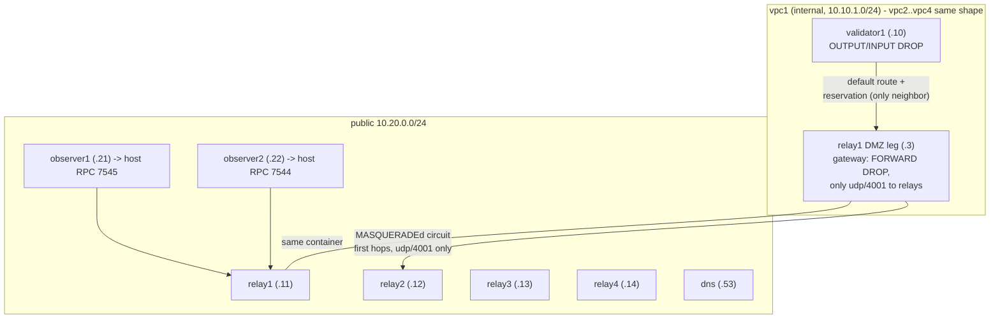

# Relay isolation testnet (circuit-relay-v2)

A 4-validator network where **every validator is locked in its own private network and its own
relay is its ONLY network neighbor**: the relay is both the front door (circuit-relay-v2
reservations) and the default gateway (the validator has no other route), so every packet a
validator sends or receives passes through its own relay box - kernel-enforced on both ends. It
exercises the client-side relay support in `crates/consensus/network` (see
`etc/test-network/RELAY_DESIGN.md` for the design and its security tradeoffs).

One protocol constraint shapes the design: circuit-relay-v2 cannot chain relays, so a circuit to
a peer must be addressed to the *peer's* relay (the one holding its reservation). Those dials
still name foreign relay IPs, but every packet of them transits - and is filtered by - the
validator's own relay: the gateway forwards nothing except udp/4001 to the other relays' public
legs.

Committee creation is identical to `local-testnet.sh --relay`: `keytool generate` bakes a concrete
`/ip4/<relay>/udp/4001/quic-v1/p2p/<relay-id>/p2p-circuit/p2p/<node-key>` advertise address into
each validator's node-info (via `RL_RELAY_ADDR`, the env form of `--relay`) and the relays run the
fixed test identities from `etc/test-network/RELAY_KEYS.md`. Each validator holds exactly ONE
reservation: its own relay's DMZ leg (`PRIMARY/WORKER_RELAY_MULTIADDRS`; the advertised public
form is skipped because the relay matches circuits to reservations by peer id). There are no
backup reservations - they would violate the only-own-relay restriction, and a swarm with zero
listeners but a desired reservation is a retried state, not a shutdown. Nodes run with
`RAYLS_NETWORK=local` (all mainnet hardforks active).

The full rationale for every design choice in this harness - and the bugs that forced them - is
in [`DESIGN-DECISIONS.md`](DESIGN-DECISIONS.md); branch-level findings are recorded in
`TODO-CRv2-NETWORKING.md` at the repo root.

## Topology



- Each `vpcN` is `internal: true`: no published ports and no route from anywhere into it. The
  validator's only egress is its own relay's DMZ leg (its default gateway), so it can dial out -
  through its relay, to relays only - but can never be dialed. All consensus traffic transits
  relay circuits.
- Each relay is dual-homed: a public leg (what the committee advertises) plus the DMZ leg inside
  the VPC. The validator's reservation - the connection every consensus byte rides in both
  directions - uses the DMZ leg directly, and dials to *foreign* relays (circuit first hops) are
  routed and MASQUERADEd through the same box. The validator's internal IP is never advertised
  (reservations carry only the relay's addresses).
- The restriction is kernel-enforced on both ends, not just observed: the validator's OUTPUT
  policy is DROP (allowed out: loopback, the own DMZ leg, relay-public udp/4001), its INPUT
  policy is DROP (allowed in: loopback, replies to its own outbound flows - circuit-relay-v2
  needs no inbound flows at all), and the relay's FORWARD policy is DROP (forwarded: only the
  validator's udp/4001 to relay public legs, plus established replies). Docker backends differ
  in how strictly they isolate bridge networks (OrbStack routes between them), hence
  in-container enforcement rather than trusting the network layout.
- The observer overrides its listeners to `/ip4/0.0.0.0/...`: libp2p-quic reuses the listening
  socket for outbound dials, and the keytool-default loopback listener would make every dial time
  out silently. Validators are immune - in relay mode they have no direct QUIC listener at all.
- `validatorN` advertises only `/ip4/10.20.0.1N/udp/4001/quic-v1/p2p/<relayN>/p2p-circuit/p2p/
  <node>` and its only listeners are relay reservations; it never opens a direct QUIC socket.
- Losing its own relay makes a validator fully dark by design (the relay is also its gateway);
  it survives the outage - a swarm with zero listeners but a desired relay reservation is a
  retried state, not a shutdown - and re-reserves when the relay returns, after which committee
  peers re-dial it on their next heartbeat.
- The observers (two of them) are dial-out-only on the public network: they can reach *only*
  relays, so if they follow the chain, the committee is provably reachable purely through relay
  circuits. They are addressed by DNS via the `dns` service: `observer1.rayls.test` (host RPC
  7545), `observer2.rayls.test` (host RPC 7544), and a round-robin `rpc.rayls.test` spanning
  both.

## Run it

```sh
make relay-up      # build + start (first build takes a while - it compiles the workspace)
make relay-down    # tear down containers + volumes
```

or directly:

```sh
docker compose -f etc/relay-network/compose.yaml up --build --remove-orphans --detach
docker compose -f etc/relay-network/compose.yaml down --remove-orphans -v
```

`GASLESS=true` and `GAS_LIMIT=<n>` are honored like in `etc/docker-network`.

## Verify

Chain progresses (this is the end-to-end proof - the observer only sees relays):

```sh
curl -s -X POST -H 'Content-Type: application/json' \
  -d '{"jsonrpc":"2.0","id":1,"method":"eth_blockNumber","params":[]}' \
  http://127.0.0.1:7545
# run twice a few seconds apart; the block number must increase
```

Validators really are isolated:

```sh
cd etc/relay-network

# nothing reaches a validator: not the public net, not another validator, not even a new flow
# from its own relay's DMZ leg
docker compose exec observer1 curl -sm3 http://10.10.1.10:8545 || echo "unreachable (expected)"
docker compose exec validator1 curl -sm3 http://10.10.2.10:8545 || echo "unreachable (expected)"
docker compose exec relay1 curl -sm3 http://10.10.1.10:8545 || echo "unreachable (expected)"

# validator RPC answers only in-container (no published ports)
docker compose exec validator1 curl -s -X POST -H 'Content-Type: application/json' \
  -d '{"jsonrpc":"2.0","id":1,"method":"eth_blockNumber","params":[]}' http://127.0.0.1:8545
```

Reservations and circuits are visible in the logs:

```sh
docker compose logs relay1 | grep -iE 'reservation|circuit' | head
docker compose logs validator1 | grep -iE 'relay|listening' | head
```

### Prove the topology deterministically

`./verify-topology.sh` turns the topology claims into hard pass/fail checks on the running stack:

1. **Relay accounting (positive proof)**: every validator pair and every observer→validator link
   must appear as a `CircuitReqAccepted` on some relay, and each relay must hold reservations
   from exactly its own validator (primary+worker via the DMZ leg) and no other. Peer ids are
   mapped from the nodes' own boot logs.
2. **Kernel packet ledger (negative proof)**: iptables OUTPUT counters on each validator
   partition ALL egress into relay-DMZ / public-relays / DNS / loopback / OTHER. After a soak
   under live consensus (default 120s, `SOAK=` to change), OTHER must be **0 packets** - the
   kernel counts every packet, so a zero is exhaustive, not sampled. The own-public-leg class
   must also be 0 (the reservation rides the DMZ leg exclusively).
3. **Inbound**: each validator's INPUT chain shows all accepted traffic is loopback or
   conntrack-established replies to flows the validator itself opened; the policy-DROP counter
   tallies unsolicited packets.
4. **Enforcement**: the validator's OUTPUT policy and its relay's FORWARD policy are both DROP -
   the only-own-relay restriction is a kernel property, not a configuration hope.

`./verify-topology.sh --causal` adds the counterfactual: stop ALL relays - consensus and
observer sync must freeze completely (a single surviving direct link would keep 3/4 quorum
alive), while the validators themselves stay up (zero listeners with desired reservations is a
retried state, not a shutdown); restarting the relays must restore block production without any
node restart (reservation retry <=15s + committee re-dial on the <=30s heartbeat). **This
freezes the network for ~1-2 minutes** - do not run it while something else is using the chain.

## DNS for relay addresses

A `dns` service (dnsmasq at `10.20.0.53` on the public net) plays the role of public DNS
infrastructure: it serves an A record per relay name (`relayN.rayls.test`); observers resolve
against it via `RAYLS_DNS_SERVER` (Docker's embedded DNS cannot play this role because it only
resolves names of containers sharing a network with the requester). Validators do NOT resolve
DNS in this topology - the only-own-relay restriction blocks port 53, and their addresses are
concrete `/ip4`. A future `/dnsaddr` mode here would need the gateway relays to also forward
udp/53 to the dns service.

Where DNS names are safe to use, verified empirically:

- **Works**: `/dns4` inside addresses that are *dialed* (circuit hops, peer addresses) - the DNS
  transport resolves them and the dial proceeds normally.
- **Does not work**: `/dns4` inside a *reservation listen* address while the same relay is also
  reachable via `/ip4` circuit addresses. The relay client binds the pending reservation to the
  specific dial it issues; concurrent dials to the same relay under a different address form win
  the arbitration and the reservation listener is torn down (verified: 11/11 losses on a `/dns4`
  listener while the `/ip4` listener on the same code path held indefinitely). This is also what
  killed the earlier all-`/dns4` committee design: every reservation listener lost its boot-time
  race, the swarm hit `AllListenersClosed`, and the validators exited.
- **The right split** is the branch's `/dnsaddr` mode (`local-testnet.sh --relay-dns`): advertise
  a DNS *name* (resolved to relay circuits via `_dnsaddr` TXT records at dial time) while
  reserving on concrete `/ip4` relays from `PRIMARY/WORKER_RELAY_MULTIADDRS`. The `dns` service is
  the natural place to serve those TXT records.

## Transaction flow / load testing

Submit transactions to an observer RPC (`http://127.0.0.1:7545` or `:7544`) - they are the only
host-exposed endpoints. A non-committee node has no worker seat, so its txpool drains through a
gossip-disbursement path: the batch builder seals pool txs and `disburse_txns` publishes them on
the worker txn topic, where exactly one committee validator (selected by the first tx's slot
digest) absorbs them into its own pool for inclusion.

Two properties of that path matter for load tests:

- The observer needs the **large txpool limits** (configured in `compose.yaml`, mirroring
  `local-testnet.sh`). reth's defaults allow only **16 pool slots per sender**, so a single-sender
  load test gets "txpool is full" after 16 in-flight txs, and every rejected tx is a permanent
  nonce hole that clogs the sender.
- Disbursement is fire-and-forget: once published, txs are removed from the observer's pool with
  no delivery ack, so a dropped gossip message also becomes a nonce hole. Prefer multi-sender load
  profiles over one hot account.

## Chaos: relay failover

```sh
docker compose stop relay1     # validator1's advertised relay dies
```

Expected: validator1 goes fully dark (its relay is also its gateway) but stays up - zero
listeners with a desired reservation is a retried state, not a shutdown - and peers cannot dial
it, so consensus continues on 3/4 validators; blocks keep flowing at the observer.

```sh
docker compose start relay1    # the relay returns
```

Expected: validator1 re-reserves within ~15s (`retry_relay_reservations`) and peers re-dial it on
their next peer-manager heartbeat (30s; committee members re-dial missing members every
heartbeat, without waiting for the epoch boundary), restoring 4/4 - watch
`docker compose logs -f validator1` for the reservation, then for peer connections.

## Caveats

This is a POC harness for the relay topology, not a production deployment recipe: the relays
grant reservations to **anyone** (no ACL), and all relayed traffic hairpins through the relay
forever (the only-own-relay isolation is the point - there is no direct-link upgrade path). See
`etc/test-network/RELAY_DESIGN.md` and `TODO-CRv2-NETWORKING.md`.
