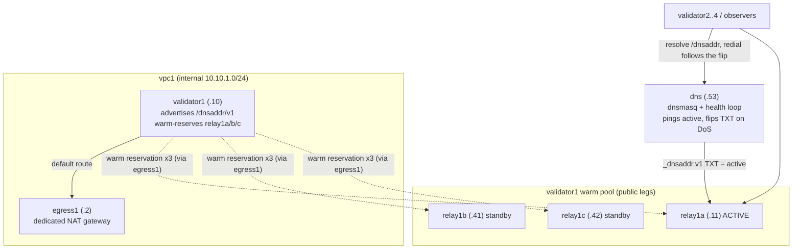

# Blue-green relay failover harness

A Docker harness that puts **validator1 behind a warm pool of relays** and fails the advertised
relay over on a DoS, automatically. It is a sibling of the base isolation harness
(`../compose.yaml`); the base is left untouched. Where the base proves *isolation* (one relay is a
validator's only neighbour), this proves *availability under a relay DoS*.

## What it demonstrates

- validator1 advertises a `/dnsaddr/v1.rayls.test` name (not a concrete relay). The
  `_dnsaddr.v1.rayls.test` TXT record names exactly **one** pool relay - the ACTIVE one. This is
  what makes it blue-green rather than active/active: peers only ever dial the advertised relay.
- validator1 holds a **warm reservation on all three** pool relays (relay1a/b/c) at once, so a
  cutover is a pure advertisement change with no reservation setup on the hot path.
- A `dns` service (dnsmasq + a health loop) pings the active relay. On a DoS it **auto-flips** the
  TXT to the next healthy warm standby and restarts dnsmasq; peers re-resolve `/dnsaddr` on their
  next redial and follow (the node re-resolves per redial, so a flipped record moves them).

## Topology

Relays here are **pure front-doors** (reservation endpoints only). The gateway/NAT role the base
harness fused into the relay is a **separate box** (`egress1`), so a DoS on the active relay cannot
take out validator1's egress or its warm standbys - the decoupling is load-bearing.



validator2..4 keep the base 1:1 relay-as-gateway shape and advertise concrete `/ip4`; they are the
peers that resolve validator1's `/dnsaddr` and follow it (so they carry `RAYLS_DNS_SERVER` + a DNS
egress allowance). Replicating the pool to them is mechanical - give each its own egress + pool +
`/dnsaddr`, exactly as validator1 has here.

## Run it

Only one harness runs at a time (both reuse the same subnets), and this one needs FRESH volumes
(validator1's node-info must be regenerated as `/dnsaddr`, not the base's concrete `/ip4`):

```sh
cd etc/relay-network
docker compose -f compose.yaml down                              # free the subnets (base data kept)
docker compose -f compose.failover.yaml up -d --remove-orphans   # project: relay-failover
```

Back to the base isolation harness:

```sh
docker compose -f compose.failover.yaml down                     # or `down -v` to wipe failover data
docker compose -f compose.yaml up -d
```

## Verify

```sh
./failover/verify-failover.sh          # HOLD=<s> tunes the DoS window (default 45)
```

It resets the active relay to relay1a, confirms all three pool relays hold validator1's reservation
and that peers reach validator1 through relay1a only, then DoSes relay1a and asserts: the TXT
auto-flips to a warm standby, and **validator1 stays in consensus** (its height tracks the observer
throughout and catches up). Drive a single cutover by hand with `./failover/dos.sh relay1a on|off`.

## What the DoS actually exercises (honest finding)

Holding relay1a down and watching heights shows validator1 stays at ~0 lag while the **observer**
briefly falls behind and then recovers. That is the real shape of the result:

- A **committee validator** is meshed to its peers through *their* relays (committee re-dial), so
  DoSing its own advertised relay cannot isolate it - the warm pool + auto-flip add inbound
  redundancy on top. Recovery is defense-in-depth, not solely "peers re-home onto the standby".
- A **pure follower** (observer) reaches the committee only through relays, so it is the party the
  blue-green flip most directly rescues. Failover matters most for followers and for *initial* peer
  connections, less for a well-connected validator.

## Limits (same as any blue-green / moving-target defense)

- The standby is only safe while its address is not already known to the attacker. A fixed pool
  survives a bounded number of cutovers; true moving-target defense needs a *fresh* address per
  cutover (a genuinely new relay each time, which needs a runtime reservation-add hook on the node -
  not built here; this harness models rotation as advancing through a pre-warmed pool).
- No help against a flood of the shared infrastructure both relays sit behind (same host/AS). Real
  resilience needs the pool spread across independent failure domains.
- The health signal here is ICMP reachability of the active relay (a POC proxy for "relay gone"); a
  real deployment would use circuit success rate / packet-rate metrics.
